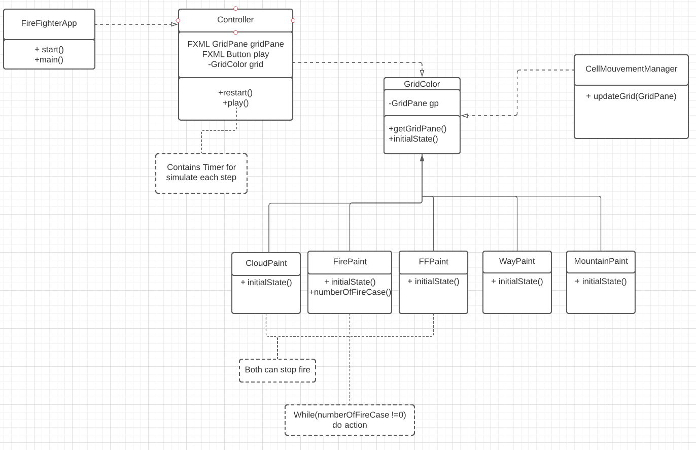
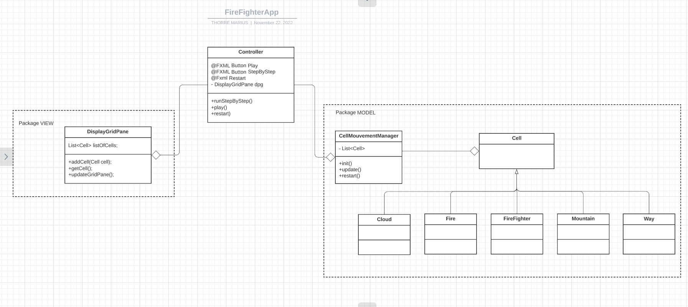

Semaine 1
---

Dans un premier temps, mettons en place le pattern MVC qui est bien adapté pour faire
des applications avec des interfaces graphiques. 

Le modele va contenir la partie calcul, la vue, elle s'occupera de la partie graphique, et pour finir le controller fera
la transition entre les deux.

Voici la description de chacun de ces repos:

- # View:
  - GridColor une classe concraite, son rôle est de s'occuper des couleurs de chaque cases.
  
- # Controller:
  - Il effectue la transition avec le fichier FXML fire-fighter et la classe Grid (pour le moment).

-----------------
Objectif 1:
--
Afin d'obtenir une première version de mon application qui fonctionne, voici l'UML sur lequel je décide de me baser.

Semaine 2
---

Après avoir commencé à coder les classes à partir de l'uml précédent, je me suis rendu compte
que mon application avait un problème: la liaison logique et interface graphique est beaucoup trop proche, et finalemeent je ne me sers 
pas bien du pattern MVC. Une des conséquences de ce fait, est l'update des panes de la grille, je percois des conflits.
J'ai donc refait mon UML (je n'ai pas noté touts les attributs) qui devrait fasse à ce problème est respecter le principe de l'open close.
