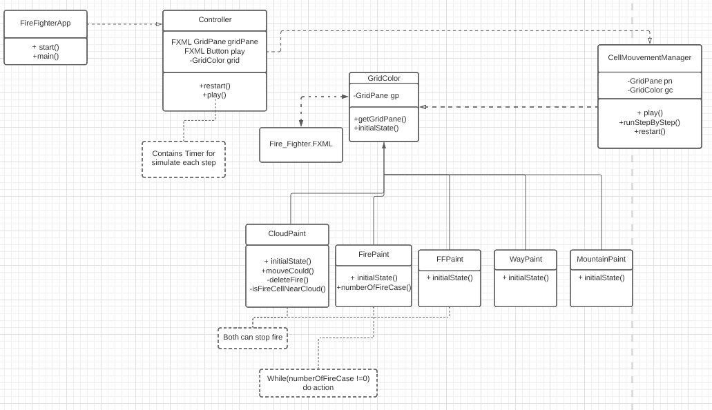

Introduction
---

Dans un premier temps, mettons en place le pattern MVC qui est bien adapté pour faire
des applications avec des interfaces graphiques. 

Le modele va contenir la partie calcul, la vue, elle s'occupera de la partie graphique, et pour finir le controller fera
la transition entre les deux.

----

- # Semaine 1:
-> Dans un premier temps, j'ai commencé par dessiner un UML qui représente une première version de mon application

Le but est d'abord de créer une aplciation fonctionnel et de respecter le "single responsabiility", et la semaine prochaine, j'envisage de soigner l'architecture 
et afin de respecter "l'open close".

-> La branche à regarder pour le moment est dynamic_task, car j'ai terminé d'implémenter l'uml, seulement 
je suis face à un problème sur le déplacement des cases (en cours de traitement, j'espère finir ça avant le weekend).

---
- # Ce qui est prévu de faire pour la semaine 2:
Comme je l'ai dit précédement, après avoir finir de coder une première version fonctionnel de mon appli.
Je vais penser pattern pour respecter les principes SOLID (même si c'est dernier sont anti-SOLID)

TO BE CONTINUED .....
