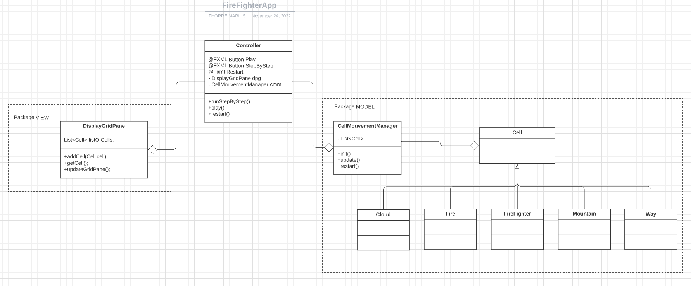

Semaine 1
---

Dans un premier temps, mettons en place le pattern MVC qui est bien adapté pour faire
des applications avec des interfaces graphiques. 

Le modele va contenir la partie calcul, la vue, elle s'occupera de la partie graphique, et pour finir le controller fera
la transition entre les deux.

Voici la description de chacun de ces repos:

- # View:
  - GridColor une classe concraite, son rôle est de s'occuper des couleurs de chaque cases.
  
- # Controller:
  - Il effectue la transition avec le fichier FXML fire-fighter et la classe Grid (pour le moment).

- # Model:
  - Ce repertoire contient toute la partie calculatoire de FireFighterApp et PademicApp.
-----------------
Objectif 1:
--
Afin d'obtenir une première version de mon application qui fonctionne, voici l'UML sur lequel je décide de me baser.

Semaine 2
---

Après avoir commencé à coder les classes à partir de l'uml précédent, je me suis rendu compte
que mon application avait un problème: la liaison logique et interface graphique est beaucoup trop proche, et finalemeent je ne me sers 
pas bien du pattern MVC. Une des conséquences de ce fait, est l'update des panes de la grille, je percois des conflits.
J'ai donc refait mon UML (je n'ai pas noté touts les attributs) qui devrait fasse à ce problème est respecter le principe de l'open close.

Semaine 3 / Rendu Finale
---

L'architecture que j'ai décidé de mettre en place est assez simple et ouverte à l'extension. La gestion des déplacements 
de chaque case se fait dans les classes ...FFCellMouvementManager et PandemicCellMouvement.
Ces deux dernière implémente une interface Manager. Imaginons que le client décide d'avoir un nouveau jeux. Il suffira de creer 
une classe qui implement Manager et d'ajouter des cases dans le switch de l'énumeration ColorPaint. Les types de cellules héritent tous de la classe mère Cell.

Difficultés rencontrées:
---
-> La structure de donnée qui permet de stocker chaque case. Dans un premier temps, j'ai utilisé une List<Cell> mais je me suis rendu compte que pour pointer les cases, 
afin d'effectuer des opérations comme le changement de couleur etc ... J'ai du tout changer et transformer cette liste en un tableau de Cell, avec taille fixe.

-> Mise à jour des cases. J'ai passé du temps sur l'update des couleurs car lorsque je modifié la case courrante, cela changer le tableau courrant. J'ai donc pensé à créer un 
nouveau tableau. De ce fait, j'ai réussi à gérer la mise à jour.

-> La liaison Modèle et View trop proche. La cause de plusieurs premiers bugs dans mon application était due à une proximité entre ces deux mondes, trop importantes.
J'ai remarqué que j'utilisais mal le pattern MVC. Mais après m'etre rendu compte de cette erreur. J'ai bien vue la puissance de ce dernier.

Règles:
---
-> Pour fireFighterApp, l'application ouvre une interface graphique constituer d'une grille de 1473 cases (choisis de manière arbitraire).
L'utilisateur a le choix entre appuyer sur le bouton Play, StepByStep et restart. Comme le nom l'indique, play va lancer le jeu de manière automatique.
Le mode stepBySTep, permet à l'utilisateur de faire un avancement pas à pas de l'application. Et le Bouton restart de recommencer.
Fonctionnement du jeux: Chaque pompier représenter par la case noir, peut se déplacer d'une ou deux cases.
(Attention 9 conditions apparaissent, en fonction de la position du pompier, 
une gestion des dépassements et alors nécessaires)

---
 

Des cases feux sont aussi dans la grille, ces derniers peuvent se propager à chaque tour pour d'une case voisine.
Des nuages placés aléatoirement peuvent éteindre des feux (pour simplifier le projet le déplacement se fait que de la gauche vers la droite).
Des montagnes placées aléatoirement sur la grille, servent de blocage pour les pompiers. 
Des chemins placés arbitrairement ne sont franchissables que par les pompiers.
Le but est d'éteindre tous les feux.

-> Pour pandemicApp, c'est la même chose.

Des cases docteurs, ces derniers soignent des personnes infectées, case verte et pour les remettre sur pied (case grise). 
Les personnes infectées peuvent contaminer d'autre personne en se déplaçant. Le but est d'éradiquer le virus.